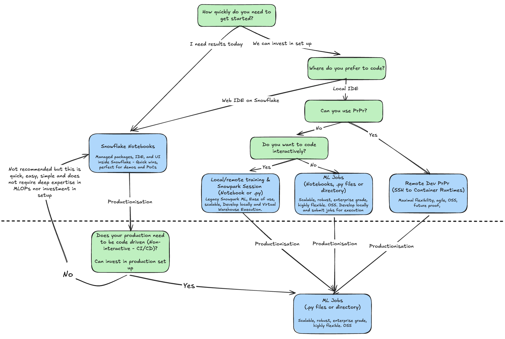

# Implementation Guide

This guide helps you choose the right implementation approach for building a Customer Lifetime Value (CLV) regression model based on your team's maturity level and requirements.

## 📊 Implementation Maturity Matrix

| Level | Approach | Best For | Complexity | Where It Runs |
|-------|----------|----------|------------|---------------|
| 1 | [Snowflake Notebooks](#1-snowflake-notebooks) | Learning, POC, Ad-hoc analysis | ⭐ Low | Snowflake UI |
| 2 | [Python Files - Snowpark Sessions](#2-snowpark-sessions) | Development, Testing, Local work | ⭐⭐ Medium | Local / Snowflake Warehouse |
| 3 | [Python Files - ML Jobs](#3-ml-jobs) | Production, Scheduled training | ⭐⭐⭐ High | Snowflake (scalable) |

---

## Decision Framework

Use the visual decision tree below (click to enlarge) to pick the right implementation based on your team's goals, tooling preference, and operational needs.



**Interpretation Tips**

1. **Need speed and governance?** → Start with **Snowflake Notebooks** to avoid local setup entirely.
2. **Experienced DS/ML team comfortable with Python tooling?** → Move to **Snowpark Sessions** for maximal flexibility, IDE support, and Git workflows (with the trade-off that scalability depends on how you orchestrate runs).
3. **Need scheduled retraining, scale, and Snowflake-managed runtime?** → Use **ML Jobs**. You can still develop locally, but execution happens inside Snowflake Container Services with full Snowflake compute power.

Remember: you can mix approaches. Many teams **prototype in Notebooks**, **industrialize with Snowpark Sessions**, and then **operationalize with ML Jobs**.

### Quick Decision Guide

| If you want to... | Use |
|-------------------|-----|
| Learn and experiment in Snowflake | **Level 1: Snowflake Notebooks** |
| Develop locally with your favorite IDE | **Level 2: Snowpark Sessions** |
| Run production ML pipelines on a schedule | **Level 3: ML Jobs** |
| Share notebooks with non-technical users | **Level 1: Snowflake Notebooks** |
| Version control and CI/CD integration | **Level 2 or 3** |
| scalable, managed compute | **Level 3: ML Jobs** |

---

## 1. Snowflake Notebooks

**📁 Location:** `implementations/01_snowflake_notebooks/`

### Overview
Run ML workflows directly in the Snowflake UI using Snowflake Notebooks. Packages, IDE, kernels, and compute are fully managed by Snowflake—which means you still get scalable, Snowflake-powered compute, but without any local setup or environment management.

### When to Use
- ✅ Learning Snowflake ML capabilities
- ✅ Quick data exploration and prototyping
- ✅ Sharing work with stakeholders (no setup needed)
- ✅ Ad-hoc analysis and experimentation
- ✅ When you want zero local configuration
- ⚠️ Limited IDE features compared to local development
- ❌ Not ideal for complex version control workflows

### How It Works
```
┌─────────────────────────────────────────────────────────────┐
│                    Snowflake UI                             │
│  ┌───────────────────────────────────────────────────────┐  │
│  │              Snowflake Notebook                       │  │
│  │                                                       │  │
│  │   [Python Cell] ──► [SQL Cell] ──► [Python Cell]     │  │
│  │         │               │               │             │  │
│  │         ▼               ▼               ▼             │  │
│  │   Load Data      Query Tables    Train Model          │  │
│  │                                                       │  │
│  └───────────────────────────────────────────────────────┘  │
│                         │                                   │
│                         ▼                                   │
│              Snowflake Warehouse (Compute)                  │
└─────────────────────────────────────────────────────────────┘
```

### Key Features
- **No local setup** - Runs entirely in browser
- **Mixed cells** - Combine Python and SQL in one notebook
- **Built-in collaboration** - Share with team members
- **Snowflake compute** - Uses your warehouse for processing
- **Native integrations** - Direct access to Snowflake objects

### Skills Required
- Basic Python
- Basic SQL
- Snowflake UI navigation

---

## 2. Snowpark Sessions

**📁 Location:** `implementations/02_snowpark_sessions/`

### Overview
Develop and run ML workflows locally using Snowpark Python sessions. This approach is more flexible and is ideal for mature or experienced data science teams who prefer their own IDE, extensions, and local tooling. The trade‑off is that you must manage environments yourself and think about how you will scale execution beyond your local machine.

### When to Use
- ✅ Local development with full IDE features
- ✅ Debugging and testing workflows
- ✅ Version control with Git
- ✅ Complex projects with multiple files
- ✅ Integration with local tools and libraries
- ✅ CI/CD pipeline development
- ⚠️ Requires local Python environment setup
- ❌ Need to manage connections and credentials

### How It Works
```
┌─────────────────────────┐         ┌─────────────────────────┐
│     Local Machine       │         │       Snowflake         │
│  ┌───────────────────┐  │         │  ┌─────────────────┐    │
│  │   Your IDE        │  │         │  │    Warehouse    │    │
│  │  (VS Code, etc.)  │  │         │  │    (Compute)    │    │
│  │                   │  │         │  └────────┬────────┘    │
│  │  ┌─────────────┐  │  │         │           │             │
│  │  │  Snowpark   │  │  │ ──────► │           ▼             │
│  │  │  Session    │──┼──┼─────────┼──►  Execute Query       │
│  │  └─────────────┘  │  │         │           │             │
│  │        │          │  │         │           ▼             │
│  │        ▼          │  │ ◄────── │     Return Results      │
│  │   Local Results   │  │         │                         │
│  └───────────────────┘  │         └─────────────────────────┘
└─────────────────────────┘
```

### Key Features
- **Full IDE support** - Debugging, autocomplete, extensions
- **Local development** - Work offline (except execution)
- **Git integration** - Version control your code
- **Modular code** - Organize into packages and modules
- **Testing** - Unit tests and integration tests
- **Flexibility** - Mix local and Snowflake compute

### Project Structure
```
02_snowpark_sessions/
├── config/
│   └── config.yaml          # Configuration
├── src/
│   ├── __init__.py
│   ├── data_loader.py       # Data loading
│   ├── features.py          # Feature engineering
│   ├── train.py             # Model training
│   └── evaluate.py          # Evaluation
├── notebooks/
│   └── development.ipynb    # Development notebook
├── tests/
│   └── test_features.py     # Unit tests
└── main.py                  # Entry point
```

### Skills Required
- Python development
- IDE proficiency
- Git basics
- Environment management (conda)

---

## 3. ML Jobs

**📁 Location:** `implementations/03_ml_jobs/`

### Overview
Run production ML workflows using Snowflake ML Jobs. You still develop locally (often using the same Snowpark Session code), but when it's time to train or score at scale, you submit the job to Snowflake Container Runtime so it executes with full Snowflake compute power—best of both worlds between local flexibility and cloud scalability.

### When to Use
- ✅ Production ML pipelines
- ✅ Scheduled/automated model training
- ✅ Scalable, managed compute
- ✅ No infrastructure to manage
- ✅ Integration with Snowflake Model Registry
- ✅ Enterprise-grade reliability
- ⚠️ Requires understanding of ML Jobs API
- ⚠️ Less interactive than notebooks

### How It Works
```
┌─────────────────────────────────────────────────────────────┐
│                      Snowflake                              │
│                                                             │
│  ┌─────────────┐      ┌─────────────┐      ┌─────────────┐ │
│  │  Schedule/  │      │   ML Job    │      │   Model     │ │
│  │  Trigger    │ ───► │  Execution  │ ───► │  Registry   │ │
│  └─────────────┘      └─────────────┘      └─────────────┘ │
│         │                   │                     │         │
│         │                   ▼                     │         │
│         │         ┌─────────────────┐            │         │
│         │         │   Serverless    │            │         │
│         │         │    Compute      │            │         │
│         │         │  (Auto-scaled)  │            │         │
│         │         └─────────────────┘            │         │
│         │                   │                     │         │
│         ▼                   ▼                     ▼         │
│  ┌─────────────────────────────────────────────────────┐   │
│  │              Feature Store / Tables                  │   │
│  └─────────────────────────────────────────────────────┘   │
└─────────────────────────────────────────────────────────────┘
```

### Key Features
- **Scheduled** - Cron-based or event-triggered
- **Scalable** - Auto-scaled compute resources
- **Integrated** - Native Model Registry support
- **Monitored** - Built-in logging and metrics
- **Secure** - Runs within Snowflake security perimeter

### Project Structure
```
03_ml_jobs/
├── jobs/
│   ├── training_job.py      # Training job definition
│   ├── feature_job.py       # Feature computation job
│   └── inference_job.py     # Batch inference job
├── config/
│   ├── job_config.yaml      # Job configuration
│   └── schedule_config.yaml # Schedule definitions
├── src/
│   ├── features.py          # Feature logic
│   ├── train.py             # Training logic
│   └── evaluate.py          # Evaluation logic
└── notebooks/
    ├── deploy_jobs.ipynb    # Deploy and manage jobs
    └── monitor_jobs.ipynb   # Monitor job runs
```

### Typical Workflow
```
[Define Job] ──► [Deploy to Snowflake] ──► [Schedule/Trigger]
                                                  │
                                                  ▼
[Monitor] ◄── [Log Results] ◄── [Execute] ──► [Save Model]
```

### Skills Required
- Snowflake ML Jobs API
- Production ML patterns
- Scheduling and automation
- Model Registry concepts

---

## 📈 Progression Path

As you gain experience, progress through the levels:

```
┌──────────────────┐     ┌──────────────────┐     ┌──────────────────┐
│    Snowflake     │     │     Snowpark     │     │     ML Jobs      │
│    Notebooks     │ ──► │     Sessions     │ ──► │                  │
│                  │     │                  │     │                  │
│  Learn & Explore │     │ Develop & Test   │     │ Production Ready │
└──────────────────┘     └──────────────────┘     └──────────────────┘
       ⭐                       ⭐⭐                     ⭐⭐⭐
```

### Transition Tips

**Level 1 → Level 2**
- Export notebook code to .py files
- Set up local conda environment
- Configure Snowflake connection
- Add version control

**Level 2 → Level 3**
- Package code into job definitions
- Define schedules and triggers
- Set up Model Registry integration
- Configure monitoring

---

## 🚀 Getting Started

1. **Complete the setup first**: Run `Step01_Setup.ipynb` to create the demo data
2. **Choose your level** based on the decision framework above
3. **Navigate to the appropriate folder** under `implementations/`
4. **Follow the README** in each implementation folder

---

## 📚 Additional Resources

- [Snowflake Notebooks Documentation](https://docs.snowflake.com/en/user-guide/ui-snowsight/notebooks)
- [Snowpark Python Developer Guide](https://docs.snowflake.com/en/developer-guide/snowpark/python/index)
- [Snowflake ML Jobs](https://docs.snowflake.com/en/developer-guide/snowpark-ml/jobs)
- [Snowflake Model Registry](https://docs.snowflake.com/en/developer-guide/snowpark-ml/model-registry/overview)
